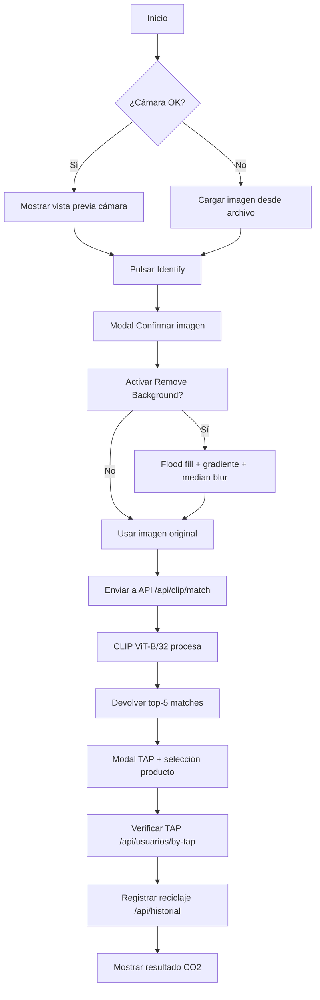

# RECREATE.md — Interfaces_PI

Guía completa para reconstruir el proyecto **Interfaces_PI** desde cero.

---

## Prerrequisitos

- **JDK 21** Eclipse Adoptium (Temurin-21.0.5+11)
- **Gradle 8.8** (incluido como `gradlew`)
- **JavaFX 21** (dependencia Gradle automática)
- **Python 3.11+** (para scripts EC2 y generación de documentos)
- **OpenCV + JavaCV 1.5.10** (vía dependencia Gradle)
- Conexión a EC2 `52.201.91.206` (SSH con clave AWS ACCESO A DATOS)
- PowerShell 5.1+ (Windows) para `run.bat`

---

## 1. Estructura del proyecto

```
Interfaces_PI/
├── AGENTS.md
├── RECREATE.md                  ← este archivo
├── session-ses_18d1.md
├── referencias/
│   ├── clip-service/
│   │   ├── app.py               ← CLIP FastAPI server
│   │   ├── Dockerfile
│   │   ├── requirements.txt
│   │   └── precompute_embeddings.py
│   ├── create_product_folders.py
│   ├── upload_extra_photos.py
│   ├── reciclaje_terminal.py
│   └── sourceApi/               ← Spring Boot API de referencia
├── fotos_extra/                  ← Fotos adicionales para entrenar CLIP
└── trabajo/                      ← PROYECTO PRINCIPAL (JavaFX)
    ├── run.bat
    ├── gradlew / gradlew.bat
    ├── build.gradle
    ├── settings.gradle
    ├── gradle.properties
    └── src/
        ├── main/
        │   ├── java/com/interfaces/app/
        │   │   ├── MainApp.java
        │   │   ├── controllers/
        │   │   │   ├── ScanController.java
        │   │   │   ├── ConfirmImageController.java
        │   │   │   └── TapAndSelectController.java
        │   │   └── utils/
        │   │       └── ApiClient.java
        │   └── resources/
        │       ├── configuration.properties
        │       ├── css/styles.css
        │       └── view/
        │           ├── main.fxml
        │           ├── scan_tab.fxml
        │           ├── confirm_image.fxml
        │           └── tap_and_select.fxml
        └── build/ (generado)
```

---

## 2. Archivos de configuración

### `trabajo/build.gradle`

```groovy
plugins {
  id 'application'
  id 'org.openjfx.javafxplugin' version '0.1.0'
}

repositories {
  mavenCentral()
}

javafx {
  version = "21"
  modules = [ 'javafx.controls', 'javafx.fxml', 'javafx.swing' ]
}

dependencies {
  implementation 'org.bytedeco:javacv-platform:1.5.10'
  implementation 'com.google.code.gson:gson:2.11.0'
}

application {
  mainClass = 'com.interfaces.app.MainApp'
}

sourceSets {
  main {
    resources {
      srcDirs = ["src/main/resources"]
      includes = ["**/*.fxml", "**/*.css", "**/*.properties", "**/*.png"]
    }
  }
}

tasks.withType(JavaCompile) {
  options.encoding = 'UTF-8'
}

tasks.withType(Test) {
  systemProperty "file.encoding", "UTF-8"
}
```

### `trabajo/settings.gradle`

```groovy
rootProject.name = 'Interfaces_PI_Trabajo'
```

### `trabajo/gradle.properties`

```properties
org.gradle.java.home=C:/Program Files/Eclipse Adoptium/jdk-21.0.5.11-hotspot
```

### `trabajo/run.bat`

```batch
@echo off
setlocal
set "JAVA_HOME=C:\Program Files\Eclipse Adoptium\jdk-21.0.5.11-hotspot"
set "PATH=%JAVA_HOME%\bin;%PATH%"
if not exist "%JAVA_HOME%\bin\java.exe" (
    echo [ERROR] No se encuentra JDK 21 en "%JAVA_HOME%".
    echo Edita run.bat y ajusta JAVA_HOME a la ruta correcta.
    pause
    exit /b 1
)
cd /d "%~dp0"
echo Usando JDK: %JAVA_HOME%
java -version
echo.
call gradlew.bat run
set "EXITCODE=%ERRORLEVEL%"
if not "%EXITCODE%"=="0" (
    echo.
    echo [ERROR] La ejecucion fallo con codigo %EXITCODE%.
    pause
)
endlocal & exit /b %EXITCODE%
```

### `trabajo/src/main/resources/configuration.properties`

```properties
api.url=http://52.201.91.206:3000
```

---

## 3. Código fuente Java

### `MainApp.java`

```java
package com.interfaces.app;

import javafx.application.Application;
import javafx.fxml.FXMLLoader;
import javafx.scene.Scene;
import javafx.scene.layout.VBox;
import javafx.stage.Stage;

public class MainApp extends Application {
    public static void main(String[] args) { launch(args); }

    @Override
    public void start(Stage stage) throws Exception {
        FXMLLoader loader = new FXMLLoader(getClass().getResource("/view/main.fxml"));
        VBox root = loader.load();
        Scene scene = new Scene(root, 520, 590);
        scene.getStylesheets().add(getClass().getResource("/css/styles.css").toExternalForm());
        stage.setTitle("ReciApp");
        stage.setScene(scene);
        stage.show();
    }
}
```

### `ApiClient.java`

```java
package com.interfaces.app.utils;

import com.google.gson.JsonObject;
import com.google.gson.JsonParser;
import java.io.InputStream;
import java.net.URI;
import java.net.URL;
import java.net.http.HttpClient;
import java.net.http.HttpRequest;
import java.net.http.HttpResponse;
import java.time.Duration;
import java.util.Properties;

public class ApiClient {
    private static ApiClient instance;
    private final HttpClient httpClient;
    private String baseUrl;
    private String jwtToken;

    private ApiClient() {
        this.httpClient = HttpClient.newBuilder()
                .connectTimeout(Duration.ofSeconds(10))
                .build();
        loadConfig();
    }

    public static synchronized ApiClient getInstance() {
        if (instance == null) instance = new ApiClient();
        return instance;
    }

    private void loadConfig() {
        try {
            URL configUrl = getClass().getResource("/configuration.properties");
            if (configUrl != null) {
                InputStream input = configUrl.openStream();
                Properties props = new Properties();
                props.load(input);
                this.baseUrl = props.getProperty("api.url", "http://52.201.91.206:3000");
                input.close();
            } else {
                this.baseUrl = "http://52.201.91.206:3000";
            }
        } catch (Exception e) {
            this.baseUrl = "http://52.201.91.206:3000";
        }
    }

    public boolean login() {
        try {
            JsonObject body = new JsonObject();
            body.addProperty("nombre", "terminal");
            body.addProperty("password", "1234");
            HttpRequest request = HttpRequest.newBuilder()
                    .uri(URI.create(baseUrl + "/api/usuarios/login"))
                    .timeout(Duration.ofSeconds(10))
                    .header("Content-Type", "application/json")
                    .POST(HttpRequest.BodyPublishers.ofString(body.toString()))
                    .build();
            HttpResponse<String> response = httpClient.send(request, HttpResponse.BodyHandlers.ofString());
            if (response.statusCode() == 200) {
                JsonObject result = JsonParser.parseString(response.body()).getAsJsonObject();
                if (result.has("token")) this.jwtToken = result.get("token").getAsString();
                return true;
            }
            return false;
        } catch (Exception e) {
            System.err.println("API login error: " + e.getMessage());
            return false;
        }
    }

    public JsonObject findByTap(String tap) throws Exception {
        HttpRequest.Builder builder = HttpRequest.newBuilder()
                .uri(URI.create(baseUrl + "/api/usuarios/by-tap/" + tap))
                .timeout(Duration.ofSeconds(10)).GET();
        if (jwtToken != null && !jwtToken.isEmpty())
            builder.header("Authorization", "Bearer " + jwtToken);
        HttpResponse<String> response = httpClient.send(builder.build(), HttpResponse.BodyHandlers.ofString());
        if (response.statusCode() == 200)
            return JsonParser.parseString(response.body()).getAsJsonObject();
        return null;
    }

    public boolean checkHealth() {
        try {
            HttpRequest request = HttpRequest.newBuilder()
                    .uri(URI.create(baseUrl + "/api/health"))
                    .timeout(Duration.ofSeconds(5)).GET().build();
            HttpResponse<String> response = httpClient.send(request, HttpResponse.BodyHandlers.ofString());
            return response.statusCode() >= 200 && response.statusCode() < 300;
        } catch (Exception e) { return false; }
    }

    public JsonObject registerRecycling(int idUsuario, String tipo, String numeroBarras) throws Exception {
        JsonObject body = new JsonObject();
        body.addProperty("idUsuario", idUsuario);
        body.addProperty("tipo", tipo);
        body.addProperty("numeroBarras", numeroBarras);
        HttpRequest.Builder builder = HttpRequest.newBuilder()
                .uri(URI.create(baseUrl + "/api/historial"))
                .timeout(Duration.ofSeconds(15))
                .header("Content-Type", "application/json")
                .POST(HttpRequest.BodyPublishers.ofString(body.toString()));
        if (jwtToken != null && !jwtToken.isEmpty())
            builder.header("Authorization", "Bearer " + jwtToken);
        HttpResponse<String> response = httpClient.send(builder.build(), HttpResponse.BodyHandlers.ofString());
        if (response.statusCode() == 201)
            return JsonParser.parseString(response.body()).getAsJsonObject();
        throw new Exception("Register failed: HTTP " + response.statusCode());
    }

    public String matchProduct(String imageBase64) throws Exception {
        JsonObject body = new JsonObject();
        body.addProperty("image", imageBase64);
        HttpRequest.Builder builder = HttpRequest.newBuilder()
                .uri(URI.create(baseUrl + "/api/clip/match"))
                .timeout(Duration.ofSeconds(60))
                .header("Content-Type", "application/json")
                .POST(HttpRequest.BodyPublishers.ofString(body.toString()));
        if (jwtToken != null && !jwtToken.isEmpty())
            builder.header("Authorization", "Bearer " + jwtToken);
        HttpResponse<String> response = httpClient.send(builder.build(), HttpResponse.BodyHandlers.ofString());
        if (response.statusCode() >= 200 && response.statusCode() < 300)
            return response.body();
        return "[]";
    }
}
```

### `ScanController.java`

```java
package com.interfaces.app.controllers;

import com.google.gson.Gson;
import com.google.gson.JsonArray;
import com.google.gson.JsonObject;
import com.interfaces.app.utils.ApiClient;
import javafx.application.Platform;
import javafx.embed.swing.SwingFXUtils;
import javafx.fxml.FXML;
import javafx.fxml.FXMLLoader;
import javafx.scene.Scene;
import javafx.scene.control.*;
import javafx.scene.image.Image;
import javafx.scene.image.ImageView;
import javafx.scene.layout.VBox;
import javafx.stage.FileChooser;
import javafx.stage.Modality;
import javafx.stage.Stage;
import org.bytedeco.javacv.Frame;
import org.bytedeco.javacv.Java2DFrameUtils;
import org.bytedeco.javacv.OpenCVFrameGrabber;
import javax.imageio.ImageIO;
import java.awt.image.BufferedImage;
import java.io.ByteArrayOutputStream;
import java.io.File;
import java.util.Base64;
import java.util.concurrent.atomic.AtomicBoolean;

public class ScanController {
    @FXML private ComboBox<String> cameraCombo;
    @FXML private ImageView cameraView;
    @FXML private Button cameraToggle;
    @FXML private Button loadImageBtn;
    @FXML private Button identifyBtn;
    @FXML private Label statusLabel;
    @FXML private ProgressBar loadingBar;

    private OpenCVFrameGrabber grabber;
    private Thread cameraThread;
    private AtomicBoolean cameraRunning = new AtomicBoolean(false);
    private AtomicBoolean cameraStarting = new AtomicBoolean(false);
    private BufferedImage lastFrame;

    @FXML
    public void initialize() {
        System.out.println("[ScanController] initialize() started");
        cameraToggle.setDisable(true);
        setStatus("Detecting cameras...");
        new Thread(() -> {
            int found = 0;
            for (int i = 0; i < 10; i++) {
                System.out.println("[ScanController] Trying camera index " + i);
                try {
                    OpenCVFrameGrabber test = new OpenCVFrameGrabber(i);
                    test.start(); test.stop(); test.release();
                    final int idx = i;
                    Platform.runLater(() -> cameraCombo.getItems().add("Camera " + idx));
                    found++;
                    System.out.println("[ScanController] Camera " + i + " found and added");
                } catch (Exception e) {
                    System.out.println("[ScanController] Camera " + i + " failed: " + e.getMessage());
                    break;
                }
            }
            final int f = found;
            Platform.runLater(() -> {
                if (f > 0) {
                    cameraCombo.getSelectionModel().select(0);
                    cameraToggle.setDisable(false);
                    setStatus("Camera detected. Click Start Camera or load an image.");
                } else {
                    setStatus("No camera found. Use 'Load Image' to select a file.");
                    cameraToggle.setDisable(true);
                }
                System.out.println("[ScanController] initialize() finished, cameras: " + f);
            });
        }, "camera-detection").start();
    }

    private void setStatus(String msg) { Platform.runLater(() -> statusLabel.setText(msg)); }

    @FXML
    private void onLoadImage() {
        System.out.println("[ScanController] onLoadImage()");
        FileChooser fc = new FileChooser();
        fc.setTitle("Select an image");
        fc.getExtensionFilters().addAll(
            new FileChooser.ExtensionFilter("Image files", "*.jpg", "*.jpeg", "*.png", "*.bmp"));
        File file = fc.showOpenDialog(cameraView.getScene().getWindow());
        if (file == null) return;
        try {
            stopCamera();
            BufferedImage bi = ImageIO.read(file);
            if (bi == null) { setStatus("Could not read the image file."); return; }
            lastFrame = cropToSquare(bi);
            Image fxImage = SwingFXUtils.toFXImage(lastFrame, null);
            cameraView.setImage(fxImage);
            setStatus("Image loaded: " + file.getName() + ". Click Identify to send it.");
        } catch (Exception e) {
            System.err.println("[ScanController] Load image error: " + e.getMessage());
            setStatus("Error loading image: " + e.getMessage());
        }
    }

    @FXML
    private void toggleCamera() {
        if (cameraRunning.get()) stopCamera();
        else startCamera();
    }

    private void startCamera() {
        if (cameraCombo.getValue() == null) return;
        if (!cameraStarting.compareAndSet(false, true)) {
            System.out.println("[ScanController] startCamera already in progress, ignoring");
            return;
        }
        int index = Integer.parseInt(cameraCombo.getValue().replace("Camera ", ""));
        System.out.println("[ScanController] startCamera(" + index + ")");
        cameraToggle.setDisable(true);
        cameraToggle.setText("Starting...");
        setStatus("Starting camera...");
        loadingBar.setVisible(true); loadingBar.setManaged(true); loadingBar.setProgress(-1);

        new Thread(() -> {
            try {
                OpenCVFrameGrabber g = new OpenCVFrameGrabber(index);
                g.setImageWidth(640); g.setImageHeight(480);
                g.start();
                System.out.println("[ScanController] Camera started successfully");
                Platform.runLater(() -> {
                    grabber = g;
                    cameraToggle.setText("Stop Camera");
                    cameraToggle.setDisable(false);
                    loadingBar.setVisible(false); loadingBar.setManaged(false);
                    setStatus("Camera running. Click Identify to capture the frame.");
                });
                cameraRunning.set(true);
                cameraStarting.set(false);

                cameraThread = new Thread(() -> {
                    while (cameraRunning.get() && !Thread.currentThread().isInterrupted()) {
                        try {
                            Frame frame = g.grab();
                            if (frame != null) {
                                BufferedImage bi = Java2DFrameUtils.toBufferedImage(frame);
                                lastFrame = cropToSquare(bi);
                                Image fxImage = SwingFXUtils.toFXImage(lastFrame, null);
                                Platform.runLater(() -> cameraView.setImage(fxImage));
                            }
                        } catch (Exception e) { /* skip */ }
                    }
                    System.out.println("[ScanController] Camera thread ended");
                });
                cameraThread.setDaemon(true);
                cameraThread.start();
            } catch (Exception e) {
                System.err.println("[ScanController] Camera error: " + e.getMessage());
                e.printStackTrace();
                cameraStarting.set(false);
                Platform.runLater(() -> {
                    cameraToggle.setText("Start Camera");
                    cameraToggle.setDisable(false);
                    loadingBar.setVisible(false); loadingBar.setManaged(false);
                    setStatus("Camera error: " + e.getMessage());
                });
            }
        }, "camera-start").start();
    }

    private void stopCamera() {
        cameraRunning.set(false); cameraStarting.set(false);
        if (cameraThread != null) {
            try { cameraThread.join(1000); } catch (InterruptedException ignored) {}
            cameraThread = null;
        }
        if (grabber != null) {
            try { grabber.stop(); grabber.release(); } catch (Exception ignored) {}
            grabber = null;
        }
        cameraToggle.setText("Start Camera");
        cameraView.setImage(null); lastFrame = null;
    }

    private BufferedImage cropToSquare(BufferedImage src) {
        int w = src.getWidth(), h = src.getHeight();
        int size = Math.min(w, h);
        return src.getSubimage((w - size) / 2, (h - size) / 2, size, size);
    }

    @FXML
    private void onIdentify() {
        if (lastFrame == null) {
            setStatus("No image to identify. Start camera or load an image first.");
            return;
        }
        BufferedImage imageToSend = showConfirmModal();
        if (imageToSend == null) { setStatus("Identification cancelled."); return; }

        identifyBtn.setDisable(true);
        identifyBtn.setText("Processing...");
        setStatus("Identifying... sending image to server.");

        new Thread(() -> {
            try {
                ByteArrayOutputStream baos = new ByteArrayOutputStream();
                BufferedImage rgb = new BufferedImage(imageToSend.getWidth(), imageToSend.getHeight(), BufferedImage.TYPE_3BYTE_BGR);
                rgb.getGraphics().drawImage(imageToSend, 0, 0, null);
                ImageIO.write(rgb, "jpeg", baos);
                String b64 = Base64.getEncoder().encodeToString(baos.toByteArray());
                String imageData = "data:image/jpeg;base64," + b64;

                ApiClient api = ApiClient.getInstance();
                String resultJson = api.matchProduct(imageData);
                System.out.println("[ScanController] API response: " + resultJson);

                Platform.runLater(() -> {
                    identifyBtn.setDisable(false);
                    identifyBtn.setText("Identify");
                    try {
                        JsonObject fullResponse = new Gson().fromJson(resultJson, JsonObject.class);
                        JsonArray matches = fullResponse.getAsJsonArray("matches");
                        JsonObject debug = fullResponse.getAsJsonObject("debug");
                        if (matches == null || matches.isEmpty()) {
                            String errMsg = debug != null && debug.has("error")
                                ? debug.get("error").getAsString()
                                : "No matches found. Try a different image.";
                            setStatus(errMsg);
                            return;
                        }
                        showTapAndSelectModal(matches, lastFrame, debug);
                    } catch (Exception e) {
                        setStatus("Error parsing results: " + e.getMessage());
                        System.err.println("[ScanController] Parse error: " + e.getMessage());
                    }
                });
            } catch (Exception e) {
                System.err.println("[ScanController] Identify failed: " + e.getMessage());
                e.printStackTrace();
                Platform.runLater(() -> {
                    identifyBtn.setDisable(false);
                    identifyBtn.setText("Identify");
                    setStatus("Identify failed: " + e.getMessage());
                });
            }
        }).start();
    }

    private BufferedImage showConfirmModal() {
        try {
            FXMLLoader loader = new FXMLLoader(getClass().getResource("/view/confirm_image.fxml"));
            VBox root = loader.load();
            ConfirmImageController confirmController = loader.getController();
            confirmController.setImage(lastFrame);

            Stage modal = new Stage();
            modal.initModality(Modality.APPLICATION_MODAL);
            modal.setTitle("Confirm Image");
            Scene scene = new Scene(root, 490, 720);
            scene.getStylesheets().add(getClass().getResource("/css/styles.css").toExternalForm());
            modal.setScene(scene);
            modal.showAndWait();
            return confirmController.isConfirmed() ? confirmController.getFinalImage() : null;
        } catch (Exception e) {
            System.err.println("[ScanController] Confirm modal error: " + e.getMessage());
            e.printStackTrace();
            return null;
        }
    }

    private void showTapAndSelectModal(JsonArray results, BufferedImage frame, JsonObject debug) {
        try {
            FXMLLoader loader = new FXMLLoader(getClass().getResource("/view/tap_and_select.fxml"));
            VBox root = loader.load();
            TapAndSelectController controller = loader.getController();
            controller.setResults(results, frame, debug);

            Stage modal = new Stage();
            modal.initModality(Modality.APPLICATION_MODAL);
            modal.setTitle("Complete Recycling");
            Scene scene = new Scene(root, 480, 600);
            scene.getStylesheets().add(getClass().getResource("/css/styles.css").toExternalForm());
            modal.setScene(scene);
            modal.showAndWait();

            if (controller.isConfirmed()) setStatus("Recycling registered successfully!");
            else setStatus("Operation cancelled.");
        } catch (Exception e) {
            System.err.println("[ScanController] TapAndSelect modal error: " + e.getMessage());
            e.printStackTrace();
        }
    }
}
```

### `ConfirmImageController.java`

```java
package com.interfaces.app.controllers;

import javafx.application.Platform;
import javafx.embed.swing.SwingFXUtils;
import javafx.fxml.FXML;
import javafx.geometry.Pos;
import javafx.scene.Scene;
import javafx.scene.control.*;
import javafx.scene.image.Image;
import javafx.scene.image.ImageView;
import javafx.scene.layout.VBox;
import javafx.stage.Modality;
import javafx.stage.Stage;
import javax.imageio.ImageIO;
import java.awt.Graphics2D;
import java.awt.RenderingHints;
import java.awt.image.BufferedImage;
import java.io.ByteArrayInputStream;
import java.io.ByteArrayOutputStream;
import java.util.ArrayDeque;
import java.util.Deque;

public class ConfirmImageController {
    @FXML private ImageView imageView;
    @FXML private Button sendBtn;
    @FXML private Button cancelBtn;
    @FXML private CheckBox bgCheckbox;
    @FXML private Slider sensitivitySlider;
    @FXML private Label sensitivityValueLabel;

    private boolean confirmed = false;
    private BufferedImage originalImage;
    private BufferedImage bgRemovedImage;

    public void setImage(BufferedImage image) {
        this.originalImage = image;
        imageView.setImage(SwingFXUtils.toFXImage(image, null));

        sensitivitySlider.valueProperty().addListener((obs, old, val) -> {
            int thresh = val.intValue();
            sensitivityValueLabel.setText(String.valueOf(thresh));
            if (bgCheckbox.isSelected()) runRemoveBackground();
        });

        bgCheckbox.selectedProperty().addListener((obs, old, selected) -> {
            sensitivitySlider.getParent().setVisible(selected);
            sensitivitySlider.getParent().setManaged(selected);
            if (selected) runRemoveBackground();
            else {
                bgRemovedImage = null;
                imageView.setImage(SwingFXUtils.toFXImage(originalImage, null));
            }
        });
    }

    private void runRemoveBackground() {
        bgCheckbox.setDisable(true);
        sensitivitySlider.setDisable(true);
        new Thread(() -> {
            try {
                int threshold = (int) sensitivitySlider.getValue();
                BufferedImage result = removeBackground(originalImage, threshold);
                Platform.runLater(() -> {
                    bgRemovedImage = result;
                    imageView.setImage(SwingFXUtils.toFXImage(result, null));
                    bgCheckbox.setDisable(false);
                    sensitivitySlider.setDisable(false);
                });
            } catch (Exception e) {
                System.err.println("[ConfirmImage] bg removal error: " + e.getMessage());
                e.printStackTrace();
                Platform.runLater(() -> {
                    bgCheckbox.setSelected(false);
                    bgCheckbox.setDisable(false);
                    sensitivitySlider.setDisable(false);
                });
            }
        }, "bg-removal").start();
    }

    public BufferedImage getFinalImage() {
        return bgCheckbox.isSelected() && bgRemovedImage != null ? bgRemovedImage : originalImage;
    }

    // ====== BACKGROUND REMOVAL: Edge-aware flood fill (pure Java, no OpenCV) ======
    private BufferedImage removeBackground(BufferedImage src, int threshold) {
        int w = src.getWidth(), h = src.getHeight();
        int[] pixels = new int[w * h];
        src.getRGB(0, 0, w, h, pixels, 0, w);

        int[] gray = new int[w * h], grad = new int[w * h];
        computeGradient(pixels, gray, grad, w, h);

        int edgeThreshold = 20;
        boolean[] bg = new boolean[w * h];
        boolean[] visited = new boolean[w * h];
        int[][] starts = {{0, 0}, {w - 1, 0}, {0, h - 1}, {w - 1, h - 1}};
        int[] cornerColors = {pixels[0], pixels[w - 1], pixels[w * (h - 1)], pixels[w * h - 1]};

        Deque<Integer> queue = new ArrayDeque<>();
        for (int c = 0; c < 4; c++) {
            int sx = starts[c][0], sy = starts[c][1];
            int idx = sy * w + sx;
            if (visited[idx]) continue;
            int refColor = cornerColors[c];
            queue.addLast(idx);
            visited[idx] = true;
            while (!queue.isEmpty()) {
                int p = queue.removeFirst();
                int px = p % w, py = p / w;
                if (colorDist(pixels[p], refColor) < threshold && grad[p] < edgeThreshold) {
                    bg[p] = true;
                    if (px > 0) { int ni = py * w + (px - 1); if (!visited[ni]) { visited[ni] = true; queue.addLast(ni); } }
                    if (px < w - 1) { int ni = py * w + (px + 1); if (!visited[ni]) { visited[ni] = true; queue.addLast(ni); } }
                    if (py > 0) { int ni = (py - 1) * w + px; if (!visited[ni]) { visited[ni] = true; queue.addLast(ni); } }
                    if (py < h - 1) { int ni = (py + 1) * w + px; if (!visited[ni]) { visited[ni] = true; queue.addLast(ni); } }
                }
            }
        }

        boolean[] blurred = medianBlurMask(bg, w, h, 3);
        for (int i = 0; i < pixels.length; i++) {
            if (blurred[i]) pixels[i] = 0xFFFFFFFF;
        }

        BufferedImage dst = new BufferedImage(w, h, BufferedImage.TYPE_INT_RGB);
        dst.setRGB(0, 0, w, h, pixels, 0, w);
        return dst;
    }

    private void computeGradient(int[] pixels, int[] gray, int[] grad, int w, int h) {
        for (int i = 0; i < pixels.length; i++) {
            int r = (pixels[i] >> 16) & 0xFF, g = (pixels[i] >> 8) & 0xFF, b = pixels[i] & 0xFF;
            gray[i] = (r * 77 + g * 151 + b * 28) >> 8;
        }
        for (int y = 1; y < h - 1; y++) {
            int row = y * w;
            for (int x = 1; x < w - 1; x++) {
                int idx = row + x;
                grad[idx] = Math.abs(gray[row + x + 1] - gray[row + x - 1])
                          + Math.abs(gray[row + w + x] - gray[row - w + x]);
            }
        }
    }

    private int colorDist(int rgb1, int rgb2) {
        int r1 = (rgb1 >> 16) & 0xFF, g1 = (rgb1 >> 8) & 0xFF, b1 = rgb1 & 0xFF;
        int r2 = (rgb2 >> 16) & 0xFF, g2 = (rgb2 >> 8) & 0xFF, b2 = rgb2 & 0xFF;
        return Math.abs(r1 - r2) + Math.abs(g1 - g2) + Math.abs(b1 - b2);
    }

    private boolean[] medianBlurMask(boolean[] mask, int w, int h, int radius) {
        boolean[] result = new boolean[mask.length];
        int r = radius / 2;
        for (int y = r; y < h - r; y++) {
            for (int x = r; x < w - r; x++) {
                int idx = y * w + x, trueCount = 0, total = 0;
                for (int dy = -r; dy <= r; dy++) {
                    int row = (y + dy) * w;
                    for (int dx = -r; dx <= r; dx++) {
                        if (mask[row + x + dx]) trueCount++;
                        total++;
                    }
                }
                result[idx] = trueCount > total / 2;
            }
        }
        return result;
    }

    @FXML
    private void preview() {
        try {
            BufferedImage img = getFinalImage();
            BufferedImage rgb = new BufferedImage(img.getWidth(), img.getHeight(), BufferedImage.TYPE_3BYTE_BGR);
            rgb.getGraphics().drawImage(img, 0, 0, null);
            ByteArrayOutputStream baos = new ByteArrayOutputStream();
            ImageIO.write(rgb, "jpeg", baos); baos.flush();
            ByteArrayInputStream bais = new ByteArrayInputStream(baos.toByteArray());
            Image fxImage = SwingFXUtils.toFXImage(ImageIO.read(bais), null);

            ImageView previewView = new ImageView(fxImage);
            previewView.setFitWidth(450); previewView.setFitHeight(450);
            VBox root = new VBox(previewView);
            root.setStyle("-fx-padding: 10; -fx-background-color: white;");
            Stage popup = new Stage();
            popup.initModality(Modality.NONE);
            popup.setTitle("After JPEG Processing");
            popup.setScene(new Scene(root, 470, 470));
            popup.show();
        } catch (Exception e) { e.printStackTrace(); }
    }

    @FXML
    private void whatAiSees() {
        try {
            BufferedImage img = getFinalImage();
            BufferedImage clipInput = new BufferedImage(224, 224, BufferedImage.TYPE_3BYTE_BGR);
            Graphics2D g = clipInput.createGraphics();
            g.setRenderingHint(RenderingHints.KEY_INTERPOLATION, RenderingHints.VALUE_INTERPOLATION_BILINEAR);
            g.drawImage(img, 0, 0, 224, 224, null); g.dispose();

            Image fxImage = SwingFXUtils.toFXImage(clipInput, null);
            ImageView iv = new ImageView(fxImage);
            iv.setFitWidth(224); iv.setFitHeight(224);
            Label label = new Label("What CLIP sees (224\u00D7224)");
            label.setStyle("-fx-font-size: 11px; -fx-text-fill: #666;");

            VBox root = new VBox(10, label, iv);
            root.setStyle("-fx-padding: 15; -fx-background-color: white;");
            root.setAlignment(Pos.TOP_CENTER);
            Stage popup = new Stage();
            popup.setTitle("CLIP Input Preview");
            popup.setScene(new Scene(root, 280, 310));
            popup.show();
        } catch (Exception e) { e.printStackTrace(); }
    }

    @FXML
    private void send() { confirmed = true; close(); }
    @FXML
    private void cancel() { confirmed = false; close(); }
    public boolean isConfirmed() { return confirmed; }
    private void close() { ((Stage) cancelBtn.getScene().getWindow()).close(); }
}
```

### `TapAndSelectController.java`

```java
package com.interfaces.app.controllers;

import com.google.gson.JsonArray;
import com.google.gson.JsonObject;
import com.interfaces.app.utils.ApiClient;
import javafx.application.Platform;
import javafx.beans.property.SimpleDoubleProperty;
import javafx.beans.property.SimpleStringProperty;
import javafx.collections.FXCollections;
import javafx.collections.ObservableList;
import javafx.fxml.FXML;
import javafx.scene.control.*;
import javafx.scene.image.Image;
import javafx.scene.image.ImageView;
import javafx.scene.layout.HBox;
import javafx.scene.layout.Priority;
import javafx.scene.layout.Region;
import javafx.scene.layout.VBox;
import javafx.stage.Stage;
import java.awt.image.BufferedImage;
import java.io.ByteArrayInputStream;
import java.io.ByteArrayOutputStream;
import java.util.ArrayList;
import java.util.List;
import javax.imageio.ImageIO;

public class TapAndSelectController {
    @FXML private PasswordField tapField;
    @FXML private TextField searchField;
    @FXML private TableView<ProductMatch> productTable;
    @FXML private TableColumn<ProductMatch, String> nameColumn;
    @FXML private TableColumn<ProductMatch, Number> scoreColumn;
    @FXML private Button acceptBtn;
    @FXML private Button cancelBtn;
    @FXML private Label statusLabel;
    @FXML private Label unknownWarningLabel;
    @FXML private VBox resultBox;
    @FXML private Label userNameLabel;
    @FXML private Label productNameLabel;
    @FXML private Label co2SavedLabel;
    @FXML private Label co2TotalLabel;
    @FXML private Button debugToggle;
    @FXML private VBox debugBox;
    @FXML private ImageView aiPreview;
    @FXML private Label embeddingLabel;
    @FXML private Label embeddingMeanLabel;
    @FXML private Label embeddingStdLabel;
    @FXML private VBox scoresBox;

    private static final double UNKNOWN_THRESHOLD = 0.35;
    private static final double RED_THRESHOLD = 0.47;

    private ApiClient api;
    private boolean confirmed = false;
    private ObservableList<ProductMatch> masterData = FXCollections.observableArrayList();

    public static class ProductMatch {
        private final SimpleStringProperty tipo, barcode, displayName;
        private final SimpleDoubleProperty score;

        public ProductMatch(String tipo, String barcode, String displayName, double score) {
            this.tipo = new SimpleStringProperty(tipo);
            this.barcode = new SimpleStringProperty(barcode);
            this.displayName = new SimpleStringProperty(displayName);
            this.score = new SimpleDoubleProperty(score);
        }
        public String getTipo() { return tipo.get(); }
        public String getBarcode() { return barcode.get(); }
        public String getDisplayName() { return displayName.get(); }
        public double getScore() { return score.get(); }
        public SimpleStringProperty tipoProperty() { return tipo; }
        public SimpleStringProperty barcodeProperty() { return barcode; }
        public SimpleStringProperty displayNameProperty() { return displayName; }
        public SimpleDoubleProperty scoreProperty() { return score; }
    }

    @FXML
    public void initialize() {
        api = ApiClient.getInstance();
        nameColumn.setCellValueFactory(cell -> cell.getValue().displayNameProperty());
        scoreColumn.setCellValueFactory(cell -> cell.getValue().scoreProperty());

        nameColumn.setCellFactory(col -> new TableCell<ProductMatch, String>() {
            @Override protected void updateItem(String item, boolean empty) {
                super.updateItem(item, empty);
                TableRow<?> row = getTableRow();
                if (item == null || empty || row == null) { setText(null); setStyle(""); return; }
                setText(item);
                ProductMatch pm = (ProductMatch) row.getItem();
                if (pm != null && pm.getScore() < RED_THRESHOLD)
                    setStyle("-fx-text-fill: red; -fx-font-weight: bold;");
                else setStyle("");
            }
        });
        scoreColumn.setCellFactory(col -> new TableCell<ProductMatch, Number>() {
            @Override protected void updateItem(Number item, boolean empty) {
                super.updateItem(item, empty);
                TableRow<?> row = getTableRow();
                if (item == null || empty || row == null) { setText(null); setStyle(""); return; }
                setText(String.format("%.1f%%", item.doubleValue() * 100));
                ProductMatch pm = (ProductMatch) row.getItem();
                if (pm != null && pm.getScore() < RED_THRESHOLD)
                    setStyle("-fx-text-fill: red; -fx-font-weight: bold;");
                else setStyle("");
            }
        });

        productTable.getSelectionModel().selectedItemProperty().addListener((obs, old, selected) -> {
            if (selected != null && selected.getScore() < RED_THRESHOLD)
                Platform.runLater(() -> productTable.getSelectionModel().clearSelection());
        });

        searchField.textProperty().addListener((obs, old, search) -> {
            if (search == null || search.isEmpty()) {
                productTable.setItems(masterData);
            } else {
                String lower = search.toLowerCase();
                List<ProductMatch> filtered = new ArrayList<>();
                for (ProductMatch m : masterData) {
                    if (m.getDisplayName().toLowerCase().contains(lower)) filtered.add(m);
                }
                productTable.setItems(FXCollections.observableArrayList(filtered));
            }
            productTable.getSelectionModel().select(0);
        });

        debugToggle.setOnAction(e -> {
            debugBox.setVisible(!debugBox.isVisible());
            debugBox.setManaged(debugBox.isVisible());
        });
    }

    public void setResults(JsonArray results) { setResults(results, null, null); }

    public void setResults(JsonArray results, BufferedImage frame, JsonObject debug) {
        masterData.clear();
        List<ProductMatch> unsorted = new ArrayList<>();
        for (int i = 0; i < results.size(); i++) {
            JsonObject item = results.get(i).getAsJsonObject();
            String key = item.get("name").getAsString();
            double score = item.get("score").getAsDouble();
            String[] parts = key.split("_", 3);
            String tipo = parts.length > 0 ? parts[0] : "";
            String barcode = parts.length > 1 ? parts[1] : "";
            String displayName = parts.length > 2 ? parts[2] : key;
            unsorted.add(new ProductMatch(tipo, barcode, displayName, score));
        }
        unsorted.sort((a, b) -> Double.compare(b.getScore(), a.getScore()));

        double topScore = unsorted.isEmpty() ? 0 : unsorted.get(0).getScore();
        if (topScore < UNKNOWN_THRESHOLD) {
            double unknownScore = Math.min(0.999, 1.0 - topScore);
            unsorted.add(0, new ProductMatch("N/A", "N/A", "No es un producto de la base de datos", unknownScore));
            unknownWarningLabel.setText("⚠ La imagen no coincide con ning\u00fan producto registrado. "
                + "Score m\u00e1ximo: " + String.format("%.1f%%", topScore * 100));
            unknownWarningLabel.setVisible(true); unknownWarningLabel.setManaged(true);
        } else {
            unknownWarningLabel.setVisible(false); unknownWarningLabel.setManaged(false);
        }

        masterData.addAll(unsorted);
        productTable.setItems(masterData);
        if (!masterData.isEmpty()) productTable.getSelectionModel().select(0);

        if (debug != null) {
            populateDebug(debug);
            if (frame != null) {
                BufferedImage resized = new BufferedImage(224, 224, BufferedImage.TYPE_3BYTE_BGR);
                resized.getGraphics().drawImage(frame, 0, 0, 224, 224, null);
                try {
                    ByteArrayOutputStream baos = new ByteArrayOutputStream();
                    ImageIO.write(resized, "jpeg", baos);
                    aiPreview.setImage(new Image(new ByteArrayInputStream(baos.toByteArray())));
                } catch (Exception e) { System.err.println("[TapAndSelect] Failed to create AI preview: " + e.getMessage()); }
            }
            debugToggle.setVisible(true);
        } else {
            debugToggle.setVisible(false); debugBox.setVisible(false); debugBox.setManaged(false);
        }
    }

    private void populateDebug(JsonObject debug) {
        JsonArray first10 = debug.getAsJsonArray("query_embedding_first_10");
        if (first10 != null) {
            StringBuilder sb = new StringBuilder("[");
            for (int i = 0; i < first10.size(); i++) {
                if (i > 0) sb.append(", ");
                sb.append(first10.get(i).getAsDouble());
            }
            sb.append(", ...]");
            embeddingLabel.setText(sb.toString());
        }
        if (debug.has("query_embedding_mean")) embeddingMeanLabel.setText("mean: " + debug.get("query_embedding_mean").getAsDouble());
        if (debug.has("query_embedding_std")) embeddingStdLabel.setText("std: " + debug.get("query_embedding_std").getAsDouble());
        JsonArray allScores = debug.getAsJsonArray("all_scores");
        if (allScores != null) populateScoreBars(allScores);
    }

    private void populateScoreBars(JsonArray allScores) {
        scoresBox.getChildren().clear();
        for (int i = 0; i < allScores.size(); i++) {
            JsonObject item = allScores.get(i).getAsJsonObject();
            String name = item.get("name").getAsString();
            double score = item.get("score").getAsDouble();
            String[] parts = name.split("_", 3);
            String displayName = parts.length > 2 ? parts[2] : name;

            HBox row = new HBox(6);
            Label nameLabel = new Label(displayName);
            nameLabel.setMinWidth(180); nameLabel.setMaxWidth(180);

            Region bar = new Region();
            bar.setMinHeight(16);
            double pct = Math.max(0, Math.min(1, score));
            bar.setMinWidth(120 * pct);
            bar.setStyle("-fx-background-color: #388e3c; -fx-background-radius: 3;");
            HBox.setHgrow(bar, Priority.NEVER);

            Region spacer = new Region();
            HBox.setHgrow(spacer, Priority.ALWAYS);

            Label scoreLabel = new Label(String.format("%.2f", score));
            scoreLabel.setMinWidth(40);

            row.getChildren().addAll(nameLabel, bar, spacer, scoreLabel);
            scoresBox.getChildren().add(row);
        }
    }

    @FXML
    private void accept() {
        String tap = tapField.getText().trim();
        if (tap.isEmpty()) { statusLabel.setStyle("-fx-text-fill: red;"); statusLabel.setText("Please enter a TAP"); return; }

        ProductMatch match = productTable.getSelectionModel().getSelectedItem();
        if (match == null) { statusLabel.setStyle("-fx-text-fill: red;"); statusLabel.setText("Please select a product from the table"); return; }
        if ("N/A".equals(match.getTipo())) { statusLabel.setStyle("-fx-text-fill: red;"); statusLabel.setText("No se puede registrar un producto no reconocido."); return; }

        acceptBtn.setDisable(true); cancelBtn.setDisable(true);
        statusLabel.setText("Verifying TAP...");

        new Thread(() -> {
            try {
                if (!api.login()) { Platform.runLater(() -> { statusLabel.setText("API authentication failed"); acceptBtn.setDisable(false); cancelBtn.setDisable(false); }); return; }
                JsonObject user = api.findByTap(tap);
                if (user == null) { Platform.runLater(() -> { statusLabel.setText("Invalid TAP - user not found"); acceptBtn.setDisable(false); cancelBtn.setDisable(false); }); return; }
                int userId = user.get("id").getAsInt();
                String userName = user.get("nombre").getAsString();
                Platform.runLater(() -> statusLabel.setText("Registering recycling..."));
                JsonObject result = api.registerRecycling(userId, match.getTipo(), match.getBarcode());
                Platform.runLater(() -> {
                    JsonObject reciclaje = result.get("reciclaje").getAsJsonObject();
                    String prodName = reciclaje.get("productoNombre").getAsString();
                    String prodMaterial = reciclaje.get("productoMaterial").getAsString();
                    double saved = reciclaje.get("emisionesReducibles").getAsDouble();
                    double total = result.get("emisionesAcumuladas").getAsDouble();
                    confirmed = true;
                    userNameLabel.setText("User: " + userName);
                    productNameLabel.setText("Product: " + prodName + " (" + prodMaterial + ")");
                    co2SavedLabel.setText("CO\u2082 saved this time: " + saved + " kg");
                    co2TotalLabel.setText("Total accumulated: " + total + " kg CO\u2082");
                    tapField.setVisible(false); searchField.setVisible(false); productTable.setVisible(false);
                    acceptBtn.setText("OK"); acceptBtn.setOnAction(e -> close()); acceptBtn.setDisable(false);
                    cancelBtn.setVisible(false); statusLabel.setText("");
                    resultBox.setVisible(true); resultBox.setManaged(true);
                });
            } catch (Exception e) {
                Platform.runLater(() -> { statusLabel.setText("Error: " + e.getMessage()); acceptBtn.setDisable(false); cancelBtn.setDisable(false); });
            }
        }).start();
    }

    @FXML
    private void cancel() { confirmed = false; close(); }
    public boolean isConfirmed() { return confirmed; }
    private void close() { ((Stage) cancelBtn.getScene().getWindow()).close(); }
}
```

---

## 4. Vistas FXML

### `main.fxml`

```xml
<?xml version="1.0" encoding="UTF-8"?>
<?import javafx.geometry.Insets?>
<?import javafx.scene.control.Label?>
<?import javafx.scene.control.Tab?>
<?import javafx.scene.control.TabPane?>
<?import javafx.scene.layout.VBox?>
<VBox alignment="TOP_CENTER" spacing="15.0" xmlns:fx="http://javafx.com/fxml/1">
   <children>
      <Label id="titulo-principal" text="ReciApp" />
      <TabPane prefHeight="550.0" prefWidth="500.0" tabClosingPolicy="UNAVAILABLE">
         <tabs>
            <Tab text="Scan">
               <content><fx:include source="scan_tab.fxml" /></content>
            </Tab>
            <Tab text="Informes">
               <content><VBox alignment="CENTER"><Label text="Informes - Coming soon" style="-fx-font-size: 18px; -fx-text-fill: #888;"/></VBox></content>
            </Tab>
         </tabs>
      </TabPane>
   </children>
   <padding><Insets bottom="10.0" left="10.0" right="10.0" top="10.0" /></padding>
</VBox>
```

### `scan_tab.fxml`

```xml
<?xml version="1.0" encoding="UTF-8"?>
<?import javafx.geometry.Insets?>
<?import javafx.scene.control.*?>
<?import javafx.scene.image.ImageView?>
<?import javafx.scene.layout.*?>
<VBox spacing="10.0" xmlns:fx="http://javafx.com/fxml/1" fx:controller="com.interfaces.app.controllers.ScanController">
   <children>
      <HBox alignment="CENTER_LEFT" spacing="10.0">
         <Label text="Camera:" />
         <ComboBox fx:id="cameraCombo" prefWidth="120.0" />
         <Button fx:id="cameraToggle" onAction="#toggleCamera" text="Start Camera" />
         <Button fx:id="loadImageBtn" onAction="#onLoadImage" text="Load Image" />
         <Button fx:id="identifyBtn" onAction="#onIdentify" text="Identify" />
      </HBox>
      <ImageView fx:id="cameraView" fitHeight="450.0" fitWidth="450.0" preserveRatio="false" style="-fx-border-color: #e0e0e0; -fx-border-width: 1px;" />
      <ProgressBar fx:id="loadingBar" visible="false" managed="false" maxWidth="Infinity" />
      <Label fx:id="statusLabel" text="Start the camera or load an image" wrapText="true" style="-fx-font-size: 11px;" />
   </children>
   <padding><Insets bottom="10.0" left="10.0" right="10.0" top="10.0" /></padding>
</VBox>
```

### `confirm_image.fxml`

```xml
<?xml version="1.0" encoding="UTF-8"?>
<?import javafx.geometry.Insets?>
<?import javafx.scene.control.*?>
<?import javafx.scene.image.ImageView?>
<?import javafx.scene.layout.*?>
<VBox alignment="TOP_CENTER" spacing="15.0" prefWidth="470.0" xmlns:fx="http://javafx.com/fxml/1" fx:controller="com.interfaces.app.controllers.ConfirmImageController">
   <children>
      <Label style="-fx-font-size: 16px; -fx-font-weight: 600;" text="Confirm the captured image" />
      <ImageView fx:id="imageView" fitHeight="450.0" fitWidth="450.0" preserveRatio="false" style="-fx-border-color: #e0e0e0; -fx-border-width: 1px;" />
      <CheckBox fx:id="bgCheckbox" text="Remove Background" selected="false" />
      <HBox alignment="CENTER" spacing="10.0" visible="false" managed="false">
         <children>
            <Label text="Sensitivity:" />
            <Slider fx:id="sensitivitySlider" min="5.0" max="100.0" value="30.0" prefWidth="200.0" />
            <Label fx:id="sensitivityValueLabel" text="30" />
         </children>
      </HBox>
      <HBox alignment="CENTER" spacing="15.0">
         <children>
            <Button onAction="#preview" text="Preview After Processing" />
            <Button onAction="#whatAiSees" text="What AI sees (224x224)" />
         </children>
      </HBox>
      <HBox alignment="CENTER" spacing="20.0">
         <children>
            <Button fx:id="cancelBtn" onAction="#cancel" prefWidth="120.0" text="Cancel" />
            <Button fx:id="sendBtn" onAction="#send" prefWidth="120.0" text="Send" />
         </children>
      </HBox>
   </children>
   <padding><Insets bottom="15.0" left="10.0" right="10.0" top="15.0" /></padding>
</VBox>
```

### `tap_and_select.fxml`

```xml
<?xml version="1.0" encoding="UTF-8"?>
<?import javafx.geometry.Insets?>
<?import javafx.scene.control.*?>
<?import javafx.scene.image.ImageView?>
<?import javafx.scene.layout.*?>
<VBox spacing="12.0" prefWidth="480.0" xmlns:fx="http://javafx.com/fxml/1" fx:controller="com.interfaces.app.controllers.TapAndSelectController">
   <children>
      <Label style="-fx-font-size: 16px; -fx-font-weight: 600;" text="Complete Recycling" />
      <Label text="TAP (6 digits):" />
      <PasswordField fx:id="tapField" promptText="Enter 6-digit TAP" />
      <Label text="Product:" />
      <TextField fx:id="searchField" promptText="Search product..." />
      <Label fx:id="unknownWarningLabel" wrapText="true" visible="false" managed="false" style="-fx-text-fill: #d32f2f; -fx-font-size: 12px; -fx-font-weight: 600;" />
      <TableView fx:id="productTable" prefHeight="160.0">
         <columns>
            <TableColumn fx:id="nameColumn" text="Product" prefWidth="320.0" />
            <TableColumn fx:id="scoreColumn" text="Score" prefWidth="120.0" />
         </columns>
      </TableView>
      <HBox alignment="CENTER_RIGHT" spacing="10.0">
         <children>
            <Button fx:id="cancelBtn" onAction="#cancel" text="Cancel" />
            <Button fx:id="acceptBtn" onAction="#accept" text="Accept" />
         </children>
      </HBox>
      <Label fx:id="statusLabel" wrapText="true" style="-fx-font-size: 12px;" />
      <VBox fx:id="resultBox" spacing="8.0" visible="false" managed="false">
         <children>
            <Label text="&#10004; Recycling Registered!" style="-fx-font-size: 14px; -fx-font-weight: 600; -fx-text-fill: #2e7d32;" />
            <Label fx:id="userNameLabel" />
            <Label fx:id="productNameLabel" />
            <Label fx:id="co2SavedLabel" />
            <Label fx:id="co2TotalLabel" />
         </children>
      </VBox>
      <Button fx:id="debugToggle" text="&#128300; AI Debug" />
      <VBox fx:id="debugBox" spacing="8.0" visible="false" managed="false">
         <children>
            <Label text="What AI sees (224x224):" style="-fx-font-weight: 600;" />
            <ImageView fx:id="aiPreview" fitWidth="224" fitHeight="224" preserveRatio="true" />
            <Label text="Query Embedding (512d) — first 10 dims:" style="-fx-font-weight: 600;" />
            <ScrollPane prefHeight="50.0" hbarPolicy="ALWAYS" vbarPolicy="NEVER"><content><Label fx:id="embeddingLabel" wrapText="false" /></content></ScrollPane>
            <HBox spacing="15.0"><children><Label fx:id="embeddingMeanLabel" text="mean: ---" /><Label fx:id="embeddingStdLabel" text="std: ---" /></children></HBox>
            <Label text="Similarity vs all products:" style="-fx-font-weight: 600;" />
            <VBox fx:id="scoresBox" spacing="4.0" />
         </children>
      </VBox>
   </children>
   <padding><Insets bottom="15.0" left="15.0" right="15.0" top="15.0" /></padding>
</VBox>
```

---

## 5. CSS (`styles.css`)

```css
.root {
    -fx-verde-claro: #e8f5e9;
    -fx-verde-suave: #c8e6c9;
    -fx-verde-medio: #81c784;
    -fx-verde-oscuro: #388e3c;
    -fx-verde-muy-oscuro: #2e7d32;
    -fx-gris-suave: #f5f5f5;
    -fx-gris-medio: #e0e0e0;
    -fx-blanco: #ffffff;
    -fx-texto-oscuro: #1b5e20;
}
* { -fx-font-family: 'Segoe UI', 'Roboto', sans-serif; }
.label { -fx-text-fill: -fx-texto-oscuro; -fx-font-size: 13px; -fx-font-weight: 500; }
#titulo-principal { -fx-font-size: 28px; -fx-font-weight: 700; -fx-text-fill: -fx-verde-oscuro; }
.text-field, .combo-box {
    -fx-font-size: 13px; -fx-background-color: -fx-blanco;
    -fx-border-color: -fx-gris-medio; -fx-border-radius: 3px;
    -fx-background-radius: 3px; -fx-border-width: 1px; -fx-padding: 3px 5px;
}
.text-field:focused, .combo-box:focused {
    -fx-border-color: -fx-verde-medio;
    -fx-effect: dropshadow(gaussian, rgba(129,199,132,0.3), 6, 0, 0, 0);
}
.button {
    -fx-background-color: -fx-verde-suave; -fx-text-fill: -fx-texto-oscuro;
    -fx-border-radius: 3px; -fx-background-radius: 3px; -fx-font-size: 13px;
    -fx-font-weight: 600; -fx-padding: 4px 12px; -fx-cursor: hand;
}
.button:hover { -fx-background-color: -fx-verde-medio; }
.button:pressed { -fx-background-color: -fx-verde-oscuro; -fx-text-fill: white; }
.combo-box .list-cell { -fx-background-color: white; -fx-text-fill: -fx-texto-oscuro; }
.combo-box-popup .list-view { -fx-background-color: white; -fx-border-color: -fx-gris-medio; }
.combo-box-popup .list-cell:hover { -fx-background-color: -fx-verde-suave; }
.tab-pane { -fx-background-color: transparent; -fx-tab-min-height: 35px; }
.tab-pane .tab-header-area { -fx-background-color: transparent; }
.tab-pane .tab {
    -fx-background-color: -fx-verde-suave; -fx-background-radius: 3px 3px 0 0;
    -fx-border-color: -fx-gris-medio; -fx-border-width: 1px 1px 0 1px; -fx-padding: 6px 15px;
}
.tab-pane .tab:selected {
    -fx-background-color: -fx-blanco;
    -fx-border-color: -fx-gris-medio -fx-gris-medio transparent -fx-gris-medio;
    -fx-font-weight: 600;
}
.tab-pane .tab-content-area {
    -fx-background-color: -fx-blanco; -fx-border-color: -fx-gris-medio;
    -fx-border-width: 1px; -fx-border-radius: 0 0 3px 3px;
    -fx-background-radius: 0 0 3px 3px; -fx-padding: 10px;
}
```

---

## 6. Servicio CLIP en EC2

### 6.1 Dockerfile (`referencias/clip-service/Dockerfile`)

```dockerfile
FROM python:3.11-slim
WORKDIR /app
COPY requirements.txt .
RUN pip install --no-cache-dir -r requirements.txt
COPY app.py .
COPY precompute_embeddings.py .
RUN python -c "import clip; clip.load('ViT-B/32')"
EXPOSE 8080
CMD ["uvicorn", "app:app", "--host", "0.0.0.0", "--port", "8080"]
```

### 6.2 requirements.txt

```
torch --index-url https://download.pytorch.org/whl/cpu
torchvision --index-url https://download.pytorch.org/whl/cpu
pillow
fastapi
uvicorn
clip-by-openai
numpy
scikit-learn
```

### 6.3 app.py (CLIP FastAPI server)

```python
import os, sys, base64, io, pickle, json
import numpy as np
import torch
import clip
from PIL import Image
from fastapi import FastAPI, Request
from sklearn.preprocessing import normalize

app = FastAPI()
device = "cuda" if torch.cuda.is_available() else "cpu"
print(f"CLIP loading ViT-B/32 on {device}...", flush=True)
model, preprocess = clip.load("ViT-B/32", device=device)
print("CLIP ViT-B/32 loaded.", flush=True)

EMB_PATH = os.environ.get("EMBEDDINGS_PATH", "/app/embeddings.pkl")
BLEND_W = float(os.environ.get("BLEND_WEIGHT", "0.5"))

db_names, db_img_embs, db_txt_embs = [], np.array([]), np.array([])
if os.path.exists(EMB_PATH):
    with open(EMB_PATH, "rb") as f:
        data = pickle.load(f)
    db_names = list(data.keys())
    db_img_embs = normalize(np.array([v["img"] for v in data.values()]))
    db_txt_embs = normalize(np.array([v["txt"] for v in data.values()]))
    print(f"Loaded {len(db_names)} embeddings from {EMB_PATH}", flush=True)
else:
    print(f"WARNING: embeddings file not found at {EMB_PATH}", flush=True)

@app.post("/match")
async def match(request: Request):
    body = await request.json()
    raw = body.get("image", "")
    if "base64," in raw: raw = raw.split("base64,")[1]
    img_bytes = base64.b64decode(raw)
    img = preprocess(Image.open(io.BytesIO(img_bytes))).unsqueeze(0).to(device)
    with torch.no_grad():
        query_emb = normalize(model.encode_image(img).cpu().numpy())
    if len(db_names) == 0:
        return {"matches": [], "debug": {"error": "no embeddings loaded"}}
    sims_img = db_img_embs @ query_emb.T
    sims_txt = db_txt_embs @ query_emb.T
    sims = BLEND_W * sims_img + (1 - BLEND_W) * sims_txt
    sims_flat = sims.flatten()
    top_k = body.get("top_k", 5)
    idxs = np.argsort(sims_flat)[-top_k:][::-1]
    all_order = np.argsort(sims_flat)[::-1]
    query_emb_list = query_emb.flatten().tolist()
    return {
        "matches": [{"name": db_names[i], "score": round(float(sims_flat[i]), 4)} for i in idxs],
        "debug": {
            "query_embedding_first_10": [round(v, 6) for v in query_emb_list[:10]],
            "query_embedding_mean": round(float(np.mean(query_emb_list)), 6),
            "query_embedding_std": round(float(np.std(query_emb_list)), 6),
            "all_scores": [{"name": db_names[i], "score": round(float(sims_flat[i]), 4)} for i in all_order]
        }
    }

@app.get("/health")
def health():
    return {"status": "ok", "embeddings": len(db_names)}
```

### 6.4 precompute_embeddings.py

```python
import os, sys, base64, io, pickle, json
import torch, clip, requests, numpy as np
from PIL import Image

API_BASE = os.environ.get("API_BASE", "http://52.201.91.206:3000")
TOKEN = os.environ.get("API_TOKEN", "")
device = "cuda" if torch.cuda.is_available() else "cpu"
model, preprocess = clip.load("ViT-B/32", device=device)

headers = {"Authorization": f"Bearer {TOKEN}"} if TOKEN else {}
resp = requests.get(f"{API_BASE}/api/admin/productos", headers=headers)
productos = resp.json()

def decode_and_embed(raw_b64):
    if "base64," in raw_b64: raw_b64 = raw_b64.split("base64,")[1]
    pil_img = Image.open(io.BytesIO(base64.b64decode(raw_b64)))
    img_input = preprocess(pil_img).unsqueeze(0).to(device)
    with torch.no_grad():
        emb = model.encode_image(img_input).cpu().numpy()
    return emb[0]

embeddings = {}
for p in productos:
    key = f"{p['tipo']}_{p['numeroBarras']}_{p['nombre']}"
    img_embs = []
    main_raw = p.get("imagen")
    if main_raw:
        try: img_embs.append(decode_and_embed(main_raw))
        except Exception as e: print(f"  ERR main img {key}: {e}")
    tipo, barras = p['tipo'], p['numeroBarras']
    try:
        fe_resp = requests.get(f"{API_BASE}/api/admin/productos/{tipo}/{barras}/fotos", headers=headers)
        if fe_resp.status_code == 200:
            for fe in fe_resp.json():
                fe_raw = fe.get("imagen")
                if fe_raw:
                    try: img_embs.append(decode_and_embed(fe_raw))
                    except Exception as e: print(f"  ERR extra img {key}: {e}")
    except Exception as e: print(f"  ERR fetching fotos for {key}: {e}")
    if not img_embs: print(f"  SKIP {key} (no images)"); continue
    avg_img_emb = np.mean(img_embs, axis=0)
    name = p.get("nombre", "")
    text = clip.tokenize([f"{name}"]).to(device)
    with torch.no_grad():
        txt_emb = model.encode_text(text).cpu().numpy()
    embeddings[key] = {"img": avg_img_emb, "txt": txt_emb[0]}
    count = len(img_embs)
    print(f"  OK  {key} ({count} photo{'s' if count>1 else ''})")

pickle.dump(embeddings, open("embeddings.pkl", "wb"))
print(f"\nSaved {len(embeddings)} embeddings to embeddings.pkl")
```

### 6.5 Spring Boot ClipService.java

```java
package com.reciapp.api.service;
import com.fasterxml.jackson.databind.ObjectMapper;
import org.springframework.beans.factory.annotation.Value;
import org.springframework.stereotype.Service;
import java.net.URI;
import java.net.http.HttpClient;
import java.net.http.HttpRequest;
import java.net.http.HttpResponse;
import java.time.Duration;
import java.util.Map;

@Service
public class ClipService {
    private final String clipUrl;
    private final HttpClient client = HttpClient.newBuilder().connectTimeout(Duration.ofSeconds(10)).build();
    private final ObjectMapper mapper = new ObjectMapper();

    public ClipService(@Value("${app.clip.url}") String clipUrl) { this.clipUrl = clipUrl; }

    public String match(String image) {
        try {
            String json = mapper.writeValueAsString(Map.of("image", image, "top_k", 5));
            HttpRequest req = HttpRequest.newBuilder()
                .uri(URI.create(clipUrl + "/match")).header("Content-Type", "application/json")
                .POST(HttpRequest.BodyPublishers.ofString(json)).timeout(Duration.ofSeconds(30)).build();
            HttpResponse<String> resp = client.send(req, HttpResponse.BodyHandlers.ofString());
            if (resp.statusCode() >= 200 && resp.statusCode() < 300) return resp.body();
            return "{\"matches\":[],\"debug\":{\"error\":\"clip-service HTTP " + resp.statusCode() + "\"}}";
        } catch (Exception e) {
            System.err.println("[ClipService] error: " + e.getMessage());
            return "{\"matches\":[],\"debug\":{\"error\":\"" + e.getMessage().replace("\"","'") + "\"}}";
        }
    }
}
```

### 6.6 Spring Boot ClipController.java

```java
package com.reciapp.api.controller;
import com.reciapp.api.service.ClipService;
import org.springframework.web.bind.annotation.*;
import java.util.Map;

@RestController
@RequestMapping("/api/clip")
public class ClipController {
    private final ClipService clipService;
    public ClipController(ClipService clipService) { this.clipService = clipService; }

    @PostMapping(value = "/match", produces = "application/json")
    public String match(@RequestBody Map<String, String> body) { return clipService.match(body.get("image")); }
}
```

### 6.7 Script de inicio en EC2 (`run5.sh`)

```bash
#!/bin/bash
java -jar reciappi-api-1.0.0.jar \
  --app.clip.url=http://127.0.0.1:8080 \
  --spring.datasource.url=jdbc:mysql://localhost:3306/reciInventario_db?useSSL=false\&allowPublicKeyRetrieval=true\&serverTimezone=UTC \
  --spring.datasource.username=root \
  --spring.datasource.password=clase1234
```

### 6.8 Comandos EC2

```bash
# Construir imagen Docker CLIP
docker build -t clip-service .

# Ejecutar contenedor
docker run -d --name clip-service -p 8080:8080 -v $(pwd)/embeddings.pkl:/app/embeddings.pkl clip-service

# Regenerar embeddings (desde EC2 o contenedor)
docker exec clip-service python precompute_embeddings.py

# Copiar script actualizado al contenedor
sudo docker cp precompute_embeddings.py clip-service:/app/precompute_embeddings.py

# Iniciar Spring Boot API
chmod +x run5.sh && ./run5.sh
```

---

## 7. Scripts Python auxiliares

### `create_product_folders.py`

```python
import os, requests
API_BASE = "http://52.201.91.206:3000"
OUTPUT = r"C:\Users\FA506NC\Desktop\Subida de nota\Interfaces_PI\fotos_extra"
resp = requests.post(f"{API_BASE}/api/usuarios/login", json={"nombre": "adminb", "password": "clase1234"}, timeout=15)
token = resp.json()["token"]
headers = {"Authorization": f"Bearer {token}"}
prods = requests.get(f"{API_BASE}/api/admin/productos", headers=headers, timeout=15).json()
os.makedirs(OUTPUT, exist_ok=True)
for p in prods:
    if not p.get("imagen"): continue
    name, barcode = p["nombre"], str(p["numeroBarras"])
    folder = os.path.join(OUTPUT, name)
    os.makedirs(folder, exist_ok=True)
    with open(os.path.join(folder, ".barcode"), "w") as f: f.write(barcode)
    print(f"  [OK] {name}  ({barcode})")
```

### `upload_extra_photos.py`

```python
import os, requests, base64, json
API_BASE = "http://52.201.91.206:3000"
SOURCE = r"C:\Users\FA506NC\Desktop\Subida de nota\Interfaces_PI\fotos_extra"
resp = requests.post(f"{API_BASE}/api/usuarios/login", json={"nombre": "adminb", "password": "clase1234"}, timeout=15)
token = resp.json()["token"]
headers = {"Authorization": f"Bearer {token}"}
prods = requests.get(f"{API_BASE}/api/admin/productos", headers=headers, timeout=15).json()
name_to_barcode = {p["nombre"]: str(p["numeroBarras"]) for p in prods if p.get("imagen")}
valid_ext = (".jpg", ".jpeg", ".png", ".bmp", ".webp")
for folder_name in os.listdir(SOURCE):
    folder_path = os.path.join(SOURCE, folder_name)
    if not os.path.isdir(folder_path): continue
    barcode = None
    barcode_file = os.path.join(folder_path, ".barcode")
    if os.path.exists(barcode_file):
        with open(barcode_file) as f: barcode = f.read().strip()
    elif folder_name in name_to_barcode: barcode = name_to_barcode[folder_name]
    if not barcode: print(f"  ?  {folder_name} — could not determine barcode, skipping"); continue
    uploaded_file = os.path.join(folder_path, ".uploaded.json")
    uploaded = {}
    if os.path.exists(uploaded_file):
        try: uploaded = json.load(open(uploaded_file))
        except: uploaded = {}
    try:
        existing = requests.get(f"{API_BASE}/api/admin/productos/EAN13/{barcode}/fotos", headers=headers, timeout=15).json()
        order = len(existing) + 1
    except: order = 1
    files = sorted([f for f in os.listdir(folder_path) if f.lower().endswith(valid_ext)])
    if not files: print(f"  -  {folder_name} ({barcode}) — no images found"); continue
    for filename in files:
        if filename in uploaded: print(f"  ~  {folder_name}  ({filename}) already uploaded, skipping"); continue
        filepath = os.path.join(folder_path, filename)
        try:
            with open(filepath, "rb") as f: b64 = base64.b64encode(f.read()).decode()
            body = {"imagen": f"data:image/jpeg;base64,{b64}", "orden": order}
            r = requests.post(f"{API_BASE}/api/admin/productos/EAN13/{barcode}/fotos", json=body, headers=headers, timeout=60)
            if r.status_code == 201:
                print(f"  \u2713 {folder_name}  orden={order}  ({filename})")
                uploaded[filename] = True
                json.dump(uploaded, open(uploaded_file, "w"))
                order += 1
            else: print(f"  \u2717 {folder_name}  orden={order}  ({r.status_code})")
        except Exception as e: print(f"  \u2717 {folder_name}  {filename}: {e}")
```

---

## 8. Comandos de compilación y ejecución

```bash
# Windows
cd trabajo
run.bat

# O manualmente:
cd trabajo
set JAVA_HOME=C:\Program Files\Eclipse Adoptium\jdk-21.0.5.11-hotspot
gradlew.bat run

# Limpiar
gradlew.bat clean

# Compilar solo (sin ejecutar)
gradlew.bat compileJava
```

---

## 9. Flujo de la aplicación



---

## 10. API Endpoints

| Método | Endpoint | Descripción |
|--------|----------|-------------|
| GET | `/api/health` | Health check |
| POST | `/api/usuarios/login` | Login (body: `{nombre, password}`) → JWT |
| GET | `/api/usuarios/by-tap/{tap}` | Buscar usuario por TAP |
| POST | `/api/clip/match` | Enviar imagen base64 para identificación CLIP |
| POST | `/api/historial` | Registrar reciclaje (auth required) |
| GET | `/api/admin/productos` | Listar todos los productos |
| GET/POST/DELETE | `/api/admin/productos/{tipo}/{barras}/fotos` | Gestionar fotos extra |

---

## 11. Notas importantes

- **JDK 21 obligatorio** — JavaFX 21 no funciona con JDK <21
- **`javacv-platform:1.5.10`** descarga ~500MB la primera vez
- **Cámara web**: el hilo de detección se ejecuta en background thread para no bloquear UI
- **GrabCut eliminado** — se reemplazó por flood fill + gradiente en Java puro para evitar JVM crashes
- **EC2**: `--app.clip.url=http://127.0.0.1:8080` (IPv4, no localhost, para evitar IPv6 timeout)
- **Respuesta CLIP**: usa `produces = "application/json"` en el endpoint Spring
- **Score < 47%** en tabla: se muestra en rojo y no se puede seleccionar
- **Unknown threshold**: 0.35 — si ningún producto supera ese score, se muestra "No es un producto de la base de datos"
